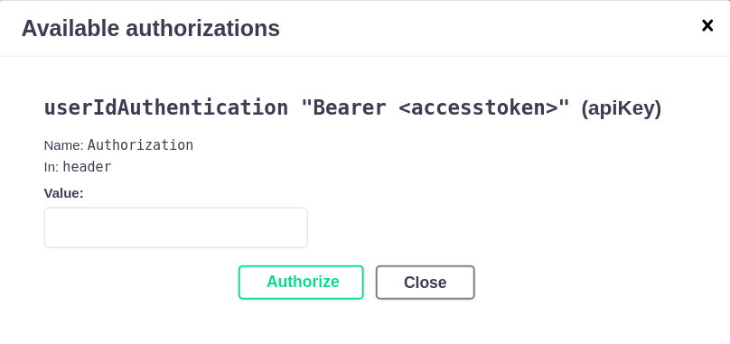

# File API

Golang REST API responsible for uploading files and store on server, delete files, list files, view files, create a user and login.

#### ps.: I've let a postman collection with all requests at resources directory

## 

## How to run

### 1. Easiest way

- You can run the docker-compose at root directory
  
  `docker-compose up`

- Wait while the containers are up and running, after that the API is ready to receive requests

### 2. Running local

#### 2.1. Setup postgres database

`
connectionUri: "host=127.0.01 port=5432 user=postgres password=admin dbname=challenge sslmode=disable"
`

- You can create a database and set the credentials on connectionUri at resources/application.yaml (line 21) 

#### 2.2 Setup golang 1.17 
<ol>
<li>Install and configure golang 1.17 on your machine: <a>https://golang.org/dl/</a></li>
<li>Inside the project root directory run:</li>
</ol>

     go mod download
     go build -o bin/api -ldflags="-s -w" ./cmd/filesd
     ./bin/api

## How to use
<ol>
    <li>Create a user</li>
    <li>Login with the user created</li>
    <li>Copy the access token on login request response</li>
    <li>Upload files passing the access token on header</li>
    <li>List the files</li>
    <li>View files using the url returned on body</li>
    <li>Delete files</li>
</ol>

**Requests**
----
#### ps.: I've let a postman collection with all requests at resources directory

### Swagger
http://localhost:8090/swagger/index.html

Almost all requests needs the access token. Just login with a user and pass the token on header

Authorization: Bearer erwerwasidfua

- [x]  Permitir upload de um arquivo (blob) com o metadado do caminho (Exemplo arquivo report.pdf com o caminho '/hr/monthly')
- [x]  Permitir download do arquivo
- [x]  Listar arquivos disponiveis com seus metadados
- [x]  Listar arquivos abaixo de um caminho com seus metadados
- [x]  Ler metadados de um arquivo via ID
- [x]  Mudar caminho do arquivo por ID
- [x]  Deletar aquivo por ID
- [x]  Sobrescrever arquivo por ID

- [x]  Limitar o tamanho máximo dos arquivos
- [x]  Criar endpoint para exibir a arvore de arquivos
- [ ]  Armazenar arquivos em um serviço compatível com a API do AWS S3
- [ ]  Subir o servidor em uma hospedagem pública e disponibilizar a url
- [x]  Isolar arquivos por usuario

- [x]  Testes iniciais
  - alguns casos implementados
- [x]  Swagger

### TODO 
- [ ]  Refactor file controller
- [ ]  Add a domain to directory
- [ ]  Adapt the API to handle multiple file upload
- [ ]  100% Test coverage
- [ ]  Add packr

